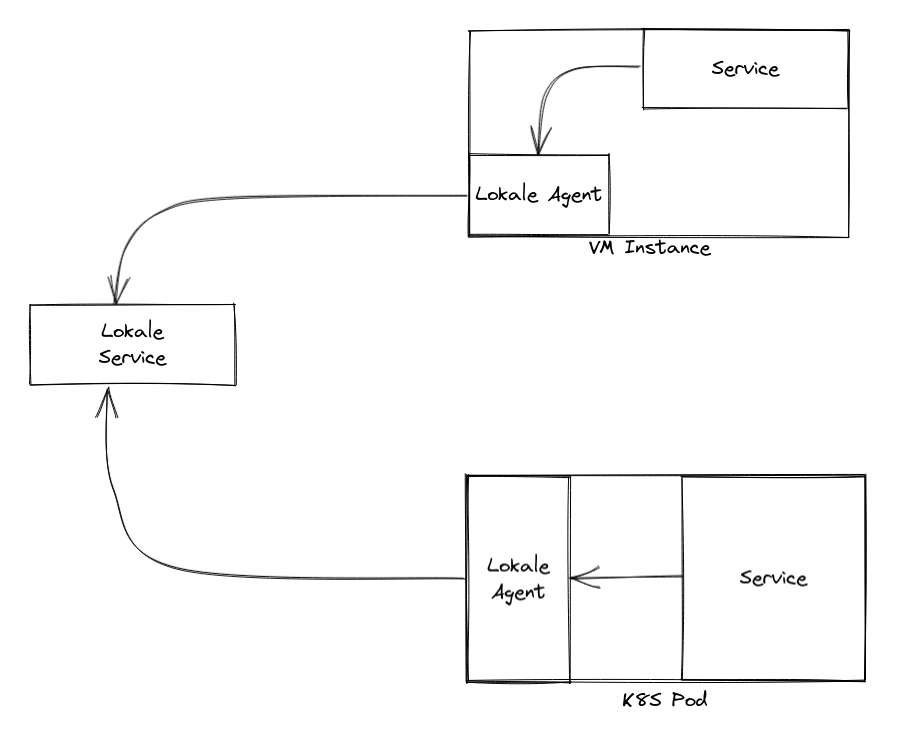
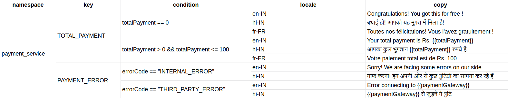

# Lokale

## Background

There are many libraries available to work with i18n in backend services, but these are often stored in json and yaml files where a developer intervention maybe required. The other way is to store in DBs, but this may require to make API to manage the translation copies on the fly.

Also, these texts are stored against a locale(”en-IN”, “hi-EN”) and are often for a single scenario, and cannot be based on conditions, say for `totalPaymentText`, we can have different texts in various locales when `totalPayment == 0` and `totalPayment > 0` as well as default when no condition matches. 

A platform to manage these copies which has a simple interface using Rest or gRPC can decrease the effort of adding the i18n feature.

## System

### Lokale Service

- Platform to manage texts along with its conditions
- All copies are identified by a `key`, where are stored against a `namespace` which will use it

### Lokale Agent

- Agent will periodically sync i18n copes against its namespace from Lokale Service
- It will be deployed in proximity to the client which will use it, say in VM as separate service or in Pod, in different container
- The application request the copies from this agent, via REST or gRPC.