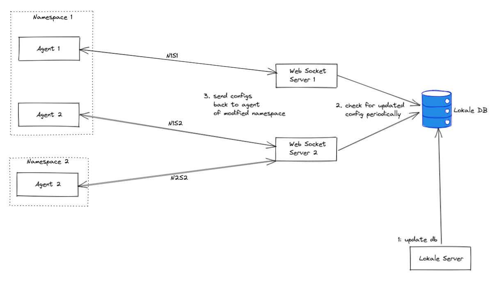
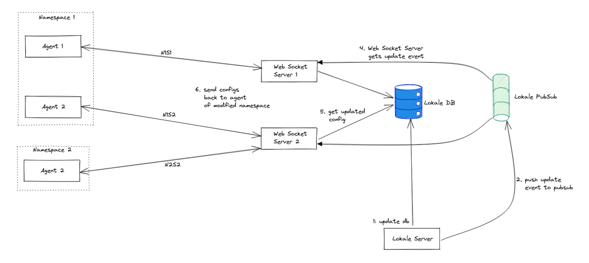

# Lokale

## Background
While adding i18n support in any service, there are two problems encountered:
- There are many libraries available to work with i18n in backend services, but these are often stored in json and yaml files where a developer intervention maybe required. The other way is to store in DBs, but this may require to make API to manage the translation.
- These texts are represnted by a `KEY` against a `LOCALE`("en-IN", "hi-IN") and are often for a single scenario, and cannot be based on conditions. For Example, if we need text for a payment
    ```py
    if total_paytment == 0 :
      translated_text = getTranslatedText("TOTAL_PAYMENT_ZERO_KEY", "en-IN")
    elif total_paytment >=0 AND total_paytment <= 100:
      translated_text = getTranslatedText("TOTAL_PAYMENT_UNDER_100_KEY", "en-IN")
    else:
      translated_text = getTranslatedText("TOTAL_PAYMENT_DEFAULT_KEY", "en-IN")
    ```

Lokale is platform to manage these copies on the fly and supports conditionals and templating.

## System

<p align="center">
  
</p>

### Lokale Service

- Platform to manage texts along with its conditions
- All copies are identified by a `key`, where are stored against a `namespace` which will use it


### Lokale Agent

- Agent will connect to Service's Websocket Server via wss protocol. This connection will be used by Server to send updated configs for Lokale.
- It will be deployed in proximity to the client which will use it, say in VM as separate service or in Pod, in different container

### Sync between Service and Agent
#### Approach 1: Websocket Server will periodically check for configs updated for a namespace

<p align="center">
  
</p>

#### Approach 2: Update Event will be used to send updated configs to agent
<p align="center">
  
</p>


<details open>
  <summary><b>To be decided</b></summary>

    1. [DONE] Which transport to use for sync?
        - short http polling
        - grpc streaming
        - websockets
       Decision: Websockets, as short polling can be resource intensive if periodicity is less and gRPC streaming has support issues with k8s ingress
    2. What should be the duration of period and how should this be configured?
    3. What should be the behaviour when sync is not active ?
    4. Should agents store config sync in-memory or embedded db + in-memory 
</details>
